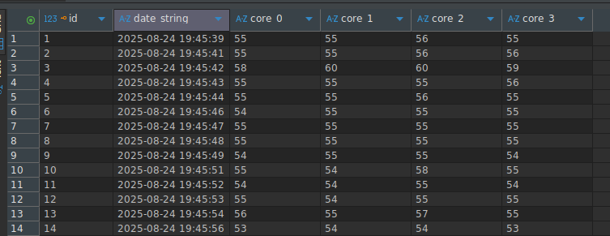

# Linux temperature history

Tracks temperature from a Linux system

Obs.: it requires the `sqlite3` command script to store the data and the python language runtime as well.

## How to use

```
chmod +x ./begin.sh
./begin.sh
```

The script will create a sqlite file called `storage.db`, that records on each second the temperature from each physical core.



